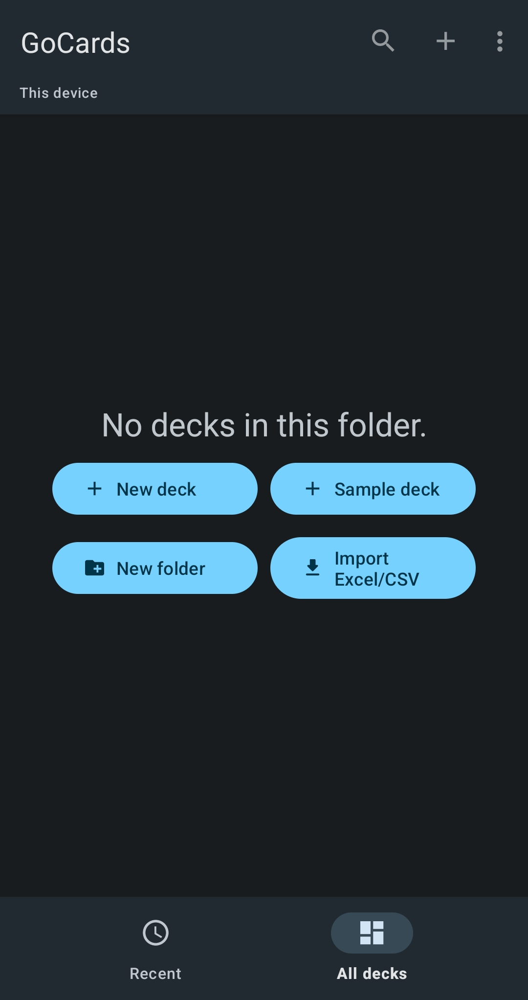
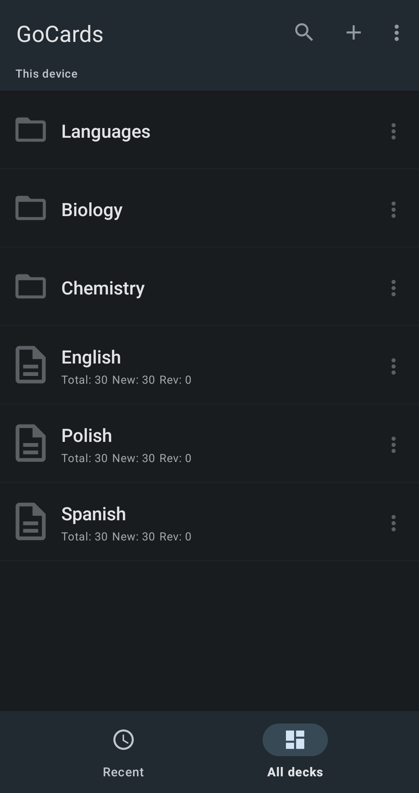
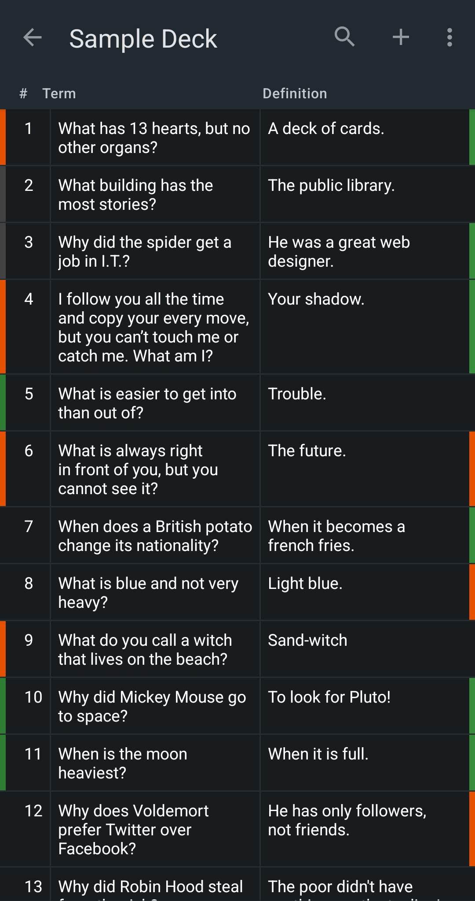
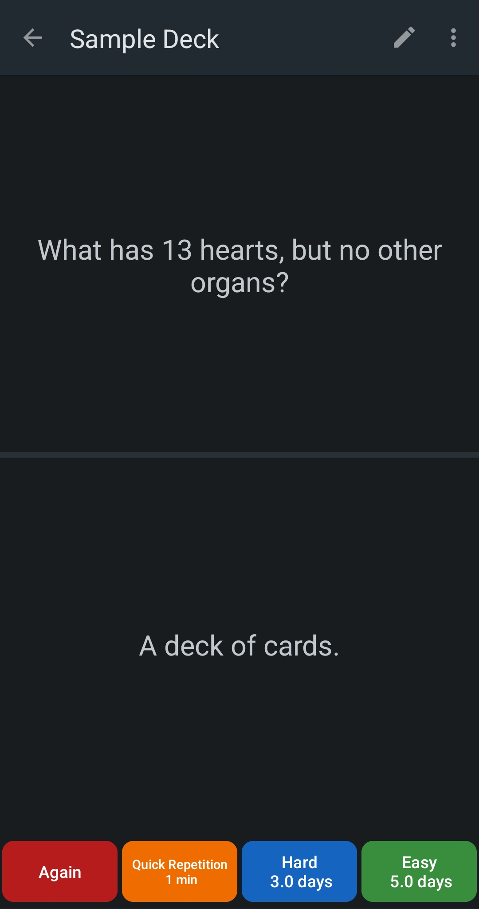

<!--suppress CheckImageSize -->
# GoCards

Learning, studying and memorizing using the anki, flashcards.

✔ <b>SEAMLESSLY SYNC CARDS BETWEEN THE APP AND EXCEL SPREADSHEETS WITHOUT LOSING YOUR LEARNING RESULTS!</b>
Effortlessly manage your cards by editing them within an Excel spreadsheet on your computer and saving them to cloud storage services such as Dropbox or Google Drive.
Any updates you make will automatically synchronize with GoCards, preserving your learning journey!

✔ <b>IMPORT AND EXPORT</b> cards from/to Excel/CSV spreadsheets.

✔ <b>INTERACTIVE CARD EDITING:</b> Easily reorder cards using intuitive drag-and-drop gesture. 
Remove cards effortlessly with a simple swipe.

✔ <b>INTERACTIVE STUDY INTERFACE</b>
Navigate through your cards smoothly using left and right swipes. 
Adjust font sizes through zoom-in/out gestures. 
Refine the term-to-definition ratio by moving a slider. 
Say goodbye to complex form fields in settings as Everything is interactive!

✔ <b>BASIC HTML TAG SUPPORT</b> such as bold text and images (img).

✔ <b>NO ADS</b>

### Become a sponsor
If you are enjoying the app and excited for new features, become a project sponsor: \
[https://www.buymeacoffee.com/gocards](https://www.buymeacoffee.com/gocards) \
Maintaining and evolving the app requires time and resources. Your contribution drives our growth. Thank you! \
Next steps include implementing a public deck catalog and integrating AI to predict optimal card repetition timings.

### Stay Connected
Stay informed about app news and engage with us on our fanpage: \
[https://www.facebook.com/people/GoCards/100092886761908/](https://www.facebook.com/people/GoCards/100092886761908/) \
From time to time, I post project updates on [Instagram Stories](https://www.instagram.com/stories/highlights/17955635591563741/). \
I value your opinions and suggestions for customizations you would like to see. Your feedback matters!

### Let's Collaborate
We welcome collaboration opportunities. Soon when I complete the necessary functionalities, I plan to focus on creating new education products.

## [Features](docs/features.md)
