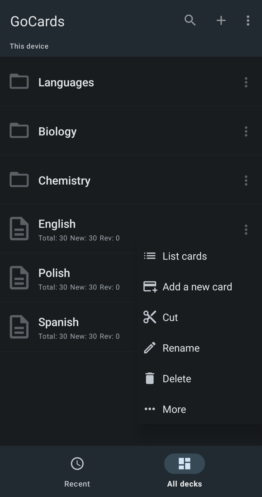
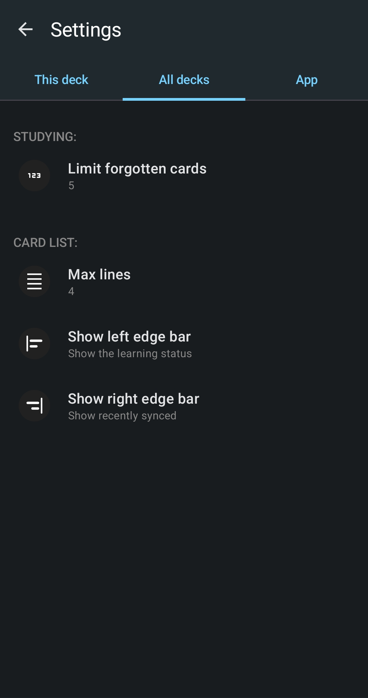
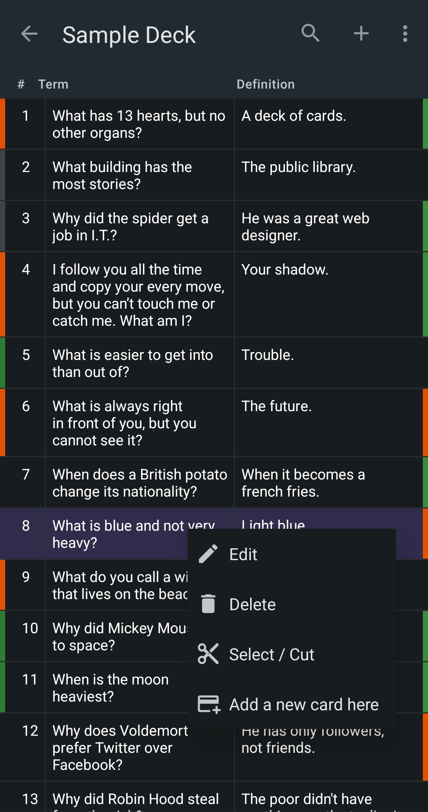
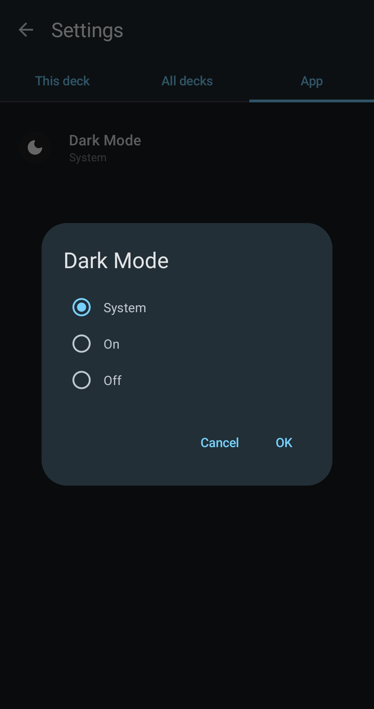

<!--suppress HtmlDeprecatedAttribute, CheckImageSize -->
# Features

## Decks
- [D_R_01](https://github.com/search?q=org%3AGoCardsEdu%20D_R_01) No deck and folders
  
  

- Decks:
    - [D_R_02](https://github.com/search?q=org%3AGoCardsEdu%20D_R_02) Show all decks
    - [D_R_03](https://github.com/search?q=org%3AGoCardsEdu%20D_R_03) Search decks
    - [D_R_04](https://github.com/search?q=org%3AGoCardsEdu%20D_R_04) No cards to repeat
    - [D_R_05](https://github.com/search?q=org%3AGoCardsEdu%20D_R_05) Show recent used decks
    - [D_C_06](https://github.com/search?q=org%3AGoCardsEdu%20D_C_06) Create a new deck
    - [D_U_07](https://github.com/search?q=org%3AGoCardsEdu%20D_U_07) Rename the deck
    - [D_R_08](https://github.com/search?q=org%3AGoCardsEdu%20D_R_08) Delete the deck
    - [D_R_09](https://github.com/search?q=org%3AGoCardsEdu%20D_R_09) Cut the deck
    - [D_U_10](https://github.com/search?q=org%3AGoCardsEdu%20D_U_10) Paste the deck
    - [D_C_11](https://github.com/search?q=org%3AGoCardsEdu%20D_C_10) Copy the deck (Not implemented yet)
    - [D_R_12](https://github.com/search?q=org%3AGoCardsEdu%20D_R_12) Export database
    - [D_C_13](https://github.com/search?q=org%3AGoCardsEdu%20D_C_13) Import database
- Folders:
  

    - [F_R_01](https://github.com/search?q=org%3AGoCardsEdu%20F_R_01) Show folders
    - [F_R_02](https://github.com/search?q=org%3AGoCardsEdu%20F_R_02) Open folder
    - [F_C_03](https://github.com/search?q=org%3AGoCardsEdu%20F_C_03) Create a folder
    - [F_U_04](https://github.com/search?q=org%3AGoCardsEdu%20F_U_04) Rename the folder
    - [F_D_05](https://github.com/search?q=org%3AGoCardsEdu%20F_D_05) Delete the folder
    - [F_C_06](https://github.com/search?q=org%3AGoCardsEdu%20F_C_05) Cut the folder
    - [F_C_07](https://github.com/search?q=org%3AGoCardsEdu%20F_C_07) Paste the folder
    - [F_C_08](https://github.com/search?q=org%3AGoCardsEdu%20F_C_08) Copy the folder (Not implemented yet)
       

## Cards
- [C_R_01](https://github.com/search?q=org%3AGoCardsEdu%20C_R_01) Display all cards \
  

  - [C_R_02](https://github.com/search?q=org%3AGoCardsEdu%20C_R_02) Search cards
  - [C_U_03](https://github.com/search?q=org%3AGoCardsEdu%20C_U_03) Dragging the card to another position.
  - [C_D_04](https://github.com/search?q=org%3AGoCardsEdu%20C_D_04) Delete the card by swiping.
  - [C_R_05](https://github.com/search?q=org%3AGoCardsEdu%20C_R_05) Show card status: disabled, forgotten on the right/left edge bar.
  - [C_R_06](https://github.com/search?q=org%3AGoCardsEdu%20C_R_06) Show card last sync status: added, updated on the right/left edge bar.

  - No cards selected
    - [C_R_07](https://github.com/search?q=org%3AGoCardsEdu%20C_R_07) Add a new card here
    - [C_R_08](https://github.com/search?q=org%3AGoCardsEdu%20C_R_08) Select (cut) the card

  - Cards selected
    - [C_R_09](https://github.com/search?q=org%3AGoCardsEdu%20C_R_09) Deselect the card
    - [C_D_10](https://github.com/search?q=org%3AGoCardsEdu%20C_D_10) Deselect the cards
    - [C_D_11](https://github.com/search?q=org%3AGoCardsEdu%20C_D_11) Delete selected cards
      - [C_U_12](https://github.com/search?q=org%3AGoCardsEdu%20C_U_12) Undelete the selected cards
    - [C_U_13](https://github.com/search?q=org%3AGoCardsEdu%20C_U_13) Paste cards before
    - [C_U_14](https://github.com/search?q=org%3AGoCardsEdu%20C_U_14) Paste cards after
- [C_R_20](https://github.com/search?q=org%3AGoCardsEdu%20C_R_20) Edit the cards
  - [C_R_21](https://github.com/search?q=org%3AGoCardsEdu%20C_R_21) No more cards to display
  - [C_R_22](https://github.com/search?q=org%3AGoCardsEdu%20C_R_22) Swipe the cards left and right
  - [C_C_23](https://github.com/search?q=org%3AGoCardsEdu%20C_C_23) Create a new card
  - [C_C_24](https://github.com/search?q=org%3AGoCardsEdu%20C_C_24) Edit the card
  - [C_D_25](https://github.com/search?q=org%3AGoCardsEdu%20C_D_25) Delete the card
    - [C_U_26](https://github.com/search?q=org%3AGoCardsEdu%20C_U_26) Undo card deletion
- [C_R_30](https://github.com/search?q=org%3AGoCardsEdu%20C_R_30) Study the cards \
  
    - [C_R_31](https://github.com/search?q=org%3AGoCardsEdu%20C_R_31) No more cards to repeat
    - [C_R_22](https://github.com/search?q=org%3AGoCardsEdu%20C_R_22) Swipe the cards left and right
    - [C_C_23](https://github.com/search?q=org%3AGoCardsEdu%20C_C_23) Create a new card
    - [C_C_24](https://github.com/search?q=org%3AGoCardsEdu%20C_C_24) Edit the card
    - [C_D_25](https://github.com/search?q=org%3AGoCardsEdu%20C_D_25) Delete the card
      - [C_U_26](https://github.com/search?q=org%3AGoCardsEdu%20C_U_26) Undo card deletion
    - [C_U_32](https://github.com/search?q=org%3AGoCardsEdu%20C_U_32) Again
    - [C_U_33](https://github.com/search?q=org%3AGoCardsEdu%20C_U_33) Quick Repetition (5 min)
    - [C_U_34](https://github.com/search?q=org%3AGoCardsEdu%20C_U_34) Hard (3 days)
    - [C_U_35](https://github.com/search?q=org%3AGoCardsEdu%20C_U_35) Easy (5 days)
    - [RPL](https://github.com/search?q=org%3AGoCardsEdu%20RPL) Schedule the next card replay.
    - [C_U_36](https://github.com/search?q=org%3AGoCardsEdu%20C_U_36) Pinch-to-zoom the term/definition
    - [C_U_37](https://github.com/search?q=org%3AGoCardsEdu%20C_U_37) Adjust the term/definition ratio by scrolling the slider.
    - [C_U_38](https://github.com/search?q=org%3AGoCardsEdu%20C_U_38) Reset view settings
    - [C_U_39](https://github.com/search?q=org%3AGoCardsEdu%20C_U_39) Undo click on the study buttons.
  
  
## Settings

- [S_R_01](https://github.com/search?q=org%3AGoCardsEdu%20S_R_01) Settings
  - [S_U_02](https://github.com/search?q=org%3AGoCardsEdu%20S_U_02) This deck: Auto-sync with the file
  - [S_U_03](https://github.com/search?q=org%3AGoCardsEdu%20S_U_03) This deck: Limit forgotten cards
  - [S_U_04](https://github.com/search?q=org%3AGoCardsEdu%20S_U_04) This deck: Max lines
  - [S_U_05](https://github.com/search?q=org%3AGoCardsEdu%20S_U_05) All decks: Limit forgotten cards
  - [S_U_06](https://github.com/search?q=org%3AGoCardsEdu%20S_U_06) All decks: Max lines
  - [S_U_07](https://github.com/search?q=org%3AGoCardsEdu%20S_U_07) All decks: Show left edge bar
  - [S_U_08](https://github.com/search?q=org%3AGoCardsEdu%20S_U_08) All decks: Show right edge bar
  - [S_U_09](https://github.com/search?q=org%3AGoCardsEdu%20S_U_09) App: Dark mode
 

## File Sync
- [FS_I](https://github.com/search?q=org%3AGoCardsEdu%20FS_I) Import the file as a new deck.
- [FS_E](https://github.com/search?q=org%3AGoCardsEdu%20FS_E) Export the deck to to a new file.
- [FS_PRO_S](https://github.com/search?q=org%3AGoCardsEdu%20FS_PRO_S) Synchronize the deck with a file.
- [FS_PRO_A](https://github.com/search?q=org%3AGoCardsEdu%20FS_PRO_A) Automatically sync with Excel file when deck is opened or closed.

## C_R_08 Select (cut) the card / C_R_09 Deselect the card
- When no card is selected and long pressing on the card, select the card.
- When any card is selected and tap on the card, select or unselect the card.
- When no card is selected and tap on the card, show the popup menu.
- When any card is selected and long pressing on the card, show the selected popup menu.

## [RPL](https://github.com/search?q=org%3AGoCardsEdu%20RPL) Schedule the next card replay.
No grading button has been clicked yet:
- [RPL.1](https://github.com/search?q=org%3AGoCardsEdu%20RPL.1) The "Again" is clicked and no button has been clicked yet. \
  Then create a new CardLearningHistory with [interval=2 days, memorized=false] \
  | Action | ReplayId | Interval | wasMemorized | memorized | \
  | Again  | 1        | 2 days   | null         | false     |
- [RPL.2](https://github.com/search?q=org%3AGoCardsEdu%20RPL.2) The "Quick Repetition (5 min)" is clicked and no button has been clicked yet. \
  Then create a new CardLearningHistory with [interval=5 minutes, memorized=true]
- [RPL.3](https://github.com/search?q=org%3AGoCardsEdu%20RPL.3) The "Hard (3 days)" is clicked and no button has been clicked yet. \
  Then create a new CardLearningHistory with [interval=3 days, memorized=true]
- [RPL.4](https://github.com/search?q=org%3AGoCardsEdu%20RPL.4) The "Easy (5 days)" is clicked and no button has been clicked yet. \
  Then create a new CardLearningHistory with [interval=5 days, memorized=true]

One of the grading buttons has been clicked earlier:
- [RPL.5](https://github.com/search?q=org%3AGoCardsEdu%20RPL.5) The "Again" is clicked and the "Again" was clicked previously. \
  Then do not change anything.
- [RPL.6](https://github.com/search?q=org%3AGoCardsEdu%20RPL.6) The "Again" is clicked and "Quick", "Hard" or "Easy" was clicked previously. \
  Then create a new CardLearningHistory with [interval=the previous interval, memorized=false] \
  | Button | id   | replayId | countMemorized | countNotMemorized | interval | wasMemorized | memorized | \
  | Easy   | 1    | 1        | 1              | 0                 | 5 days   | **false**    | true      | \
  | Again  | null | 2        | 1              | 1                 | 5 days   | null         | false     |

- [RPL.7](https://github.com/search?q=org%3AGoCardsEdu%20RPL.7) The "Quick Repetition" is clicked and "Again" was clicked previously. \
  Then update recent CardLearningHistory with [interval=1, memorized=true]

- [RPL.8](https://github.com/search?q=org%3AGoCardsEdu%20RPL.8) The "Hard" is clicked and the "Again" was clicked previously. \
  Then update recent CardLearningHistory with [interval=0.5 * the previous interval, memorized=true] \
  Then create a new CardLearningHistory with [interval=1.5 * the previous interval, memorized=true] \
  | Button | id   | replayId | countMemorized | countNotMemorized | interval  | wasMemorized | memorized | MemorizedDuration | \
  | Easy   | 1    | 1        | 1              | 0                 | 5 days    | false        | true      | 5 days            | \
  | Again  | 2    | 2        | 1              | 1                 | 2.5 days  | null         | false     | null              | \
  | Hard   | 2    | 2        | 1              | 1                 | 3.75 days | null         | true      | null              |

- [RPL.9](https://github.com/search?q=org%3AGoCardsEdu%20RPL.9) The "Hard" is clicked and "Quick", "Hard" or "Easy" was clicked previously. \
  Then create a new CardLearningHistory with [interval=1.5 * the previous interval, memorized=true] \
  | Button | id   | replayId | countMemorized | countNotMemorized | interval | wasMemorized | memorized | MemorizedDuration | \
  | Easy   | 1    | 1        | 1              | 0                 | 5 days   | **true**     | true      | 5 days            | \
  | Hard   | null | 2        | 2              | 0                 | 7.5 days | null         | true      | null              |

- [RPL.10](https://github.com/search?q=org%3AGoCardsEdu%20RPL.10) The "Easy" is clicked and the "Again" was clicked previously. \
  Then update recent CardLearningHistory with [interval=0.5 * the previous interval, memorized=true]
- [RPL.11](https://github.com/search?q=org%3AGoCardsEdu%20RPL.11) The "Easy" is clicked and "Quick", "Hard" or "Easy" was clicked previously. \
  Then create a new CardLearningHistory with [interval=2 * the previous interval, memorized=true]
